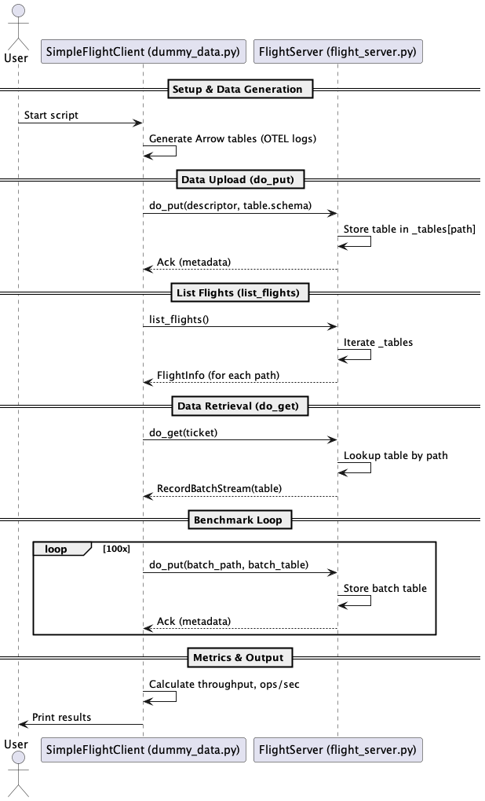

# Arrow Flight Benchmarking & Demo (dummy_data)

## Overview
This project demonstrates high-performance data transfer and benchmarking using Apache Arrow Flight. It includes a simple Arrow Flight server and a benchmarking client that generates Arrow tables and sends them to the server for storage and retrieval. The project is ideal for learning, testing, and evaluating Arrow Flight's capabilities for analytics and data engineering workflows.

## Features
- Arrow Flight server for receiving and serving Arrow tables
- Client for generating synthetic data and benchmarking Arrow Flight throughput
- Example of listing available datasets and retrieving data from the server
- Sequence diagram for the data flow

## Directory Structure
```
dummy_data/
├── dummy_data.py         # Arrow Flight client (data generation, benchmarking)
├── flight_server.py      # Arrow Flight server
└── docs/
    ├── dummy_data_sequence.puml  # Sequence diagram (PlantUML)
    └── dummy_data_sequence.png   # Sequence diagram (rendered)
```

## Prerequisites
- Python 3.8+
- Install dependencies:
  ```bash
  pip install pyarrow pandas
  ```

## Usage
### 1. Start the Arrow Flight Server
```bash
python dummy_data/flight_server.py
```

### 2. Run the Benchmarking Client
In a separate terminal:
```bash
python dummy_data/dummy_data.py
```

- The client will generate Arrow tables, send them to the server, list available datasets, retrieve data, and print throughput/benchmark results.

## Sequence Diagram


PUML source: [`docs/dummy_data_sequence.puml`](docs/dummy_data_sequence.puml)

## Example Output
```
INFO - Flight client initialized, connecting to grpc://127.0.0.1:50051
INFO - Created table for '/my_app/user_sessions' with 3 rows.
INFO - Created table for '/reports/daily_sales' with 2 rows.
INFO - Now calling list_flights to see what's available...
INFO -   Found Flight: '/my_app/user_sessions'
INFO -   Found Flight: '/reports/daily_sales'
INFO - Successfully listed 2 flights.
INFO - Successfully retrieved 2 rows from '/reports/daily_sales'.
INFO - --- Overall Performance Metrics (Benchmark do_put operations) ---
INFO - Total data sent (benchmark): 212.54 MB
INFO - Overall Throughput (MB/s): 1512.37 MB/s
```

## License
This project is provided for educational and benchmarking purposes. For questions or contributions, please open an issue or contact the maintainer.
