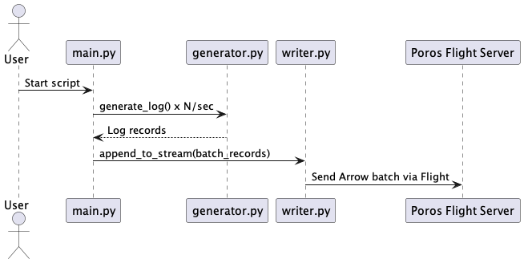

# OTEL Contract Log Generation (Apache Arrow Format)

## 1. Overview
This project demonstrates the generation, batching, and storage of OpenTelemetry (OTEL) logs using the Apache Arrow columnar format. Logs are written to Arrow files and a continuous stream file, enabling high-performance analytics, efficient storage, and easy integration with modern data processing tools. The log schema is defined according to the OTEL standard using Arrow's schema system.

## 2. Directory Structure
```
otel-arrow-batch-to-disk/
├── README.md
├── requirements.txt
├── docs/
│   ├── logGenFlow.png
│   └── logGenFlow.puml
├── files/
│   ├── otel_logs_YYYYMMDD_HHMM.arrow
│   └── otel_logs.stream
└── src/
    ├── generator.py
    ├── main.py
    ├── reader.py
    ├── schema.py
    └── writer.py
```

## 3. Sequence Diagram



PUML source: [`docs/sequence.puml`](docs/logGenFlow_v1.puml)

## 4. Getting Started

### Prerequisites
- Python 3.8 or higher
- Install dependencies:
  ```bash
  pip install -r requirements.txt
  ```

### Generating Logs
To generate OTEL logs and send them to the Poros Flight server:
```bash
python src/main.py
```
- Generates 3 OTEL logs per second.
- Batches and sends logs to the Poros Flight server every 60 seconds.
- No Arrow or stream files are written to disk in this mode.

## 5. Example Output

**main.py output:**
```
Generating 3 OTEL logs/sec — batching every 60s and sending to Poros Flight server...
Writing 180 records...
🚀 Sent batch of 180 records to Poros Flight server at grpc+tcp://127.0.0.1:50051
📡 Appended 180 records to Poros Flight server
```

---
For questions, issues, or customization requests, please open an issue or contact the project maintainer.
